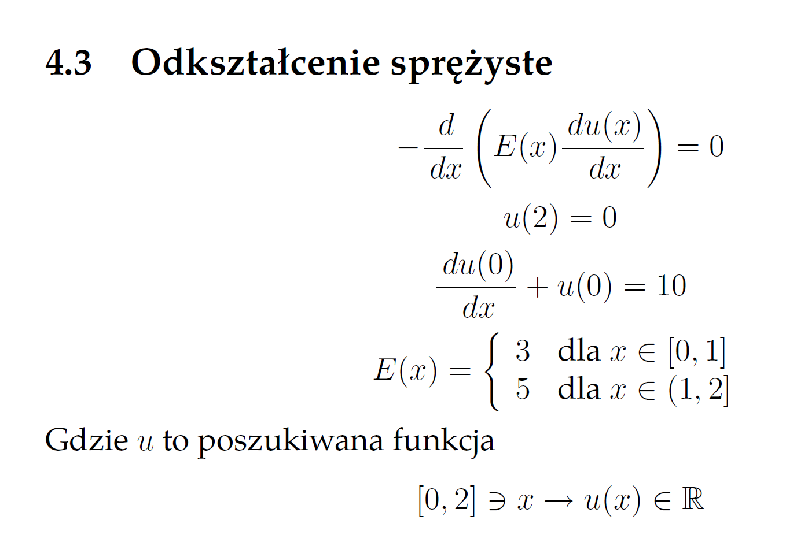
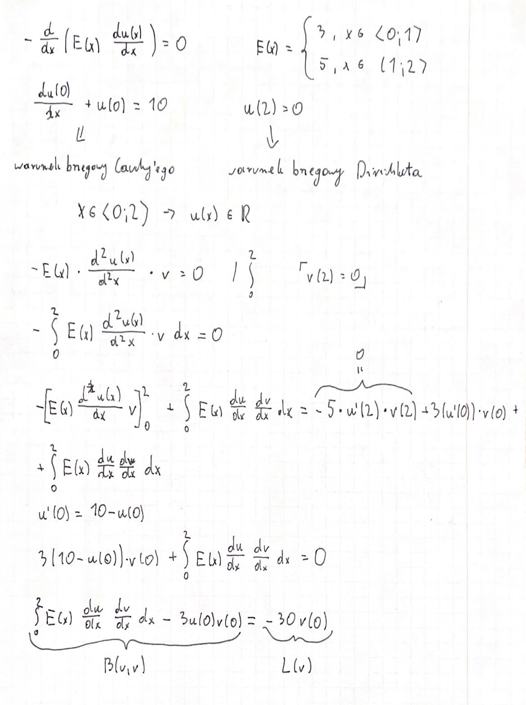
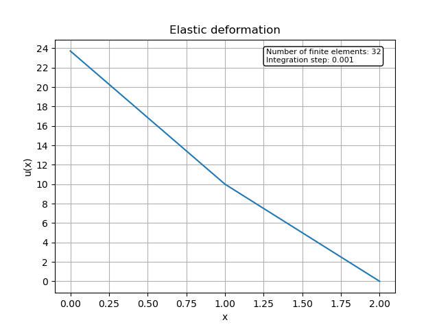

# Elastic deformation FEM solver
This is a project made within the subject of Differential Equations at AGH UST.
The code solves elastic deformation equation using Finite Element Method.
You can configure computation parameters at the beginning of main.py file.

## Problem equation

## Variational formulation

## Example solution plot
